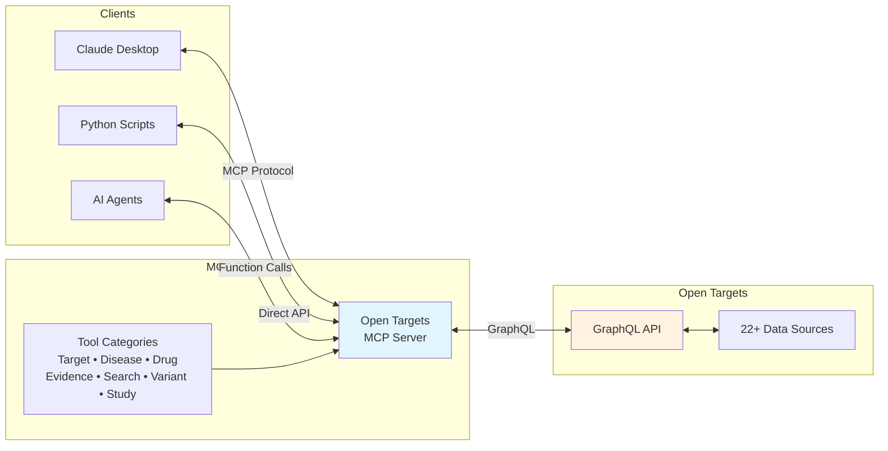

# Open Targets MCP Server

A Model Context Protocol (MCP) server that exposes the Open Targets Platform GraphQL API as a set of tools for use with Claude Desktop and other MCP-compatible clients.

## Features

### Core Capabilities

- **Target Analysis**: Search genes/proteins by Ensembl ID or symbol. Access expression data, genetic constraints, pathways, protein interactions, safety profiles, and mouse phenotypes
- **Disease Analysis**: Query diseases by EFO ID. Find associated targets, phenotypes (HPO), and research projects
- **Drug Discovery**: Search drugs by ChEMBL ID. Access safety data, adverse events, indications, and mechanism of action
- **Evidence Mining**: Explore target-disease associations with scored evidence from multiple sources
- **Variant Analysis**: Query genetic variants, GWAS credible sets, and pharmacogenomics data
- **Study Exploration**: Access GWAS studies with L2G predictions and fine-mapped loci
- **Smart Search**: Entity resolution with synonym handling, autocomplete, and ID mapping

### Data Sources

The Open Targets Platform integrates evidence from 22+ primary data sources:

- **Genetics**: Open Targets Genetics, ClinVar, UK Biobank, FinnGen, Gene2Phenotype, Orphanet, COSMIC
- **Functional**: CRISPR screens, DepMap, GeneBass
- **Drugs**: ChEMBL, FDA/EMA approvals, chemical probes
- **Expression**: GTEx, Human Protein Atlas, Expression Atlas
- **Pathways**: Reactome, Signor, IntAct
- **Literature**: Europe PMC text mining
- **Safety**: FAERS, pharmacogenomics data
- **Models**: Mouse (MGI, IMPC) phenotypes

## Architecture



The MCP server acts as a bridge between client applications and the Open Targets Platform. It translates tool calls into GraphQL queries and provides structured access to biomedical data from 22+ integrated sources.

## Prerequisites

- Python 3.12+ with pip

## Quick Start

### 1. Install UV
UV is a fast Python package and project manager.

```bash
pip install uv
```

### 2. Install MCPM (MCP Manager)
MCPM is a package manager for MCP servers that simplifies installation and configuration.

```bash
pip install mcpm
```

### 3. Setup the MCP Server
```bash
cd opentargets-mcp
uv sync
```

### 4. Add the Server to Claude Desktop
```bash
# Make sure you're in the project directory
cd opentargets-mcp

# Set Claude as the target client
mcpm target set @claude-desktop

# Add the OpenTargets MCP server using the Python from uv's environment
mcpm import stdio opentargets \
  --command "$(uv run which python)" \
  --args "-m opentargets_mcp.server"
```
Then restart Claude Desktop.

## Usage

### Running the Server Standalone
```bash
uv run python -m opentargets_mcp.server
```

### Example Scripts
```bash
uv run python examples/target_validation_profile.py EGFR
uv run python examples/disease_to_drug.py "schizophrenia"
uv run python examples/drug_safety_profile.py "osimertinib"
uv run python examples/genetic_target_prioritization.py "inflammatory bowel disease"
```

### AI Agent Example

The ReAct Agent provides an interactive terminal interface for exploring Open Targets data:


```bash
# Create .env file with your OpenAI API key
echo "OPENAI_API_KEY=your_key_here" > .env

# Run agent
uv run python examples/react_agent.py
```

The agent uses a ReAct (Reasoning and Acting) pattern to break down complex biomedical queries into steps, making it easy to explore drug targets, diseases, and their relationships.

## Development

```bash
# Run tests
uv run pytest tests/ -v
```