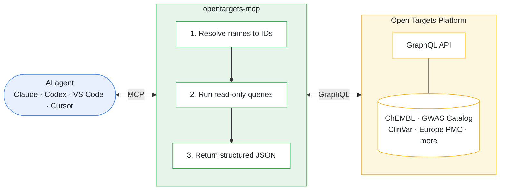

[](https://mseep.ai/app/nickzren-opentargets-mcp)

# Open Targets MCP Server

[](https://github.com/nickzren/opentargets-mcp/actions/workflows/ci.yml)
[](https://pypi.org/project/opentargets-mcp/)
[](https://www.python.org/)
[](https://registry.modelcontextprotocol.io/v0/servers?search=nickzren/opentargets&version=latest)
[](https://github.com/nickzren/opentargets-mcp/blob/main/LICENSE)

A read-only MCP server for exploring targets, diseases, drugs and genetic evidence through the [Open Targets Platform](https://platform.opentargets.org/). Use names or IDs, retrieve supporting evidence, and explore drug-repurposing candidates. No Open Targets API key required.

<!-- mcp-name: io.github.nickzren/opentargets -->

## Install

Requires [uv](https://docs.astral.sh/uv/getting-started/installation/).

**Claude Code**
```bash
claude mcp add opentargets -- uvx opentargets-mcp
```

**Claude Desktop and Cursor**: add this to `claude_desktop_config.json` (Settings → Developer → Edit Config) or `~/.cursor/mcp.json`, then restart:
```json
{
  "mcpServers": {
    "opentargets": {
      "command": "uvx",
      "args": ["opentargets-mcp"]
    }
  }
}
```

**VS Code**
```bash
code --add-mcp '{"name":"opentargets","command":"uvx","args":["opentargets-mcp"]}'
```

**Codex**
```bash
codex mcp add opentargets -- uvx opentargets-mcp
```

Any other stdio MCP client works the same way: command `uvx`, argument `opentargets-mcp`.

Tips:
- If the client reports `spawn uvx ENOENT`, use the full path from `which uvx`.
- Use `opentargets-mcp@latest` as the argument to pick up new releases.
- On Apple Silicon, a `cryptography` build error can indicate uv picked an Intel (Rosetta) Python. `uv python find` is a first clue; cached tool environments and desktop clients may use a different interpreter.

## What you can ask

- "Which drugs target EGFR, and how far along are they?"
- "Which genes are most strongly associated with asthma?"
- "Show the evidence linking BRAF to melanoma."
- "Suggest drug repurposing candidates for type 2 diabetes."

Use names or IDs: gene symbols, disease and drug names, rsIDs, or Ensembl, MONDO and ChEMBL IDs. If a name matches several entities, the tool lists the candidates so you can pick one.

## Tools

68 tools. Run `uvx opentargets-mcp --list-tools` for the full list.

| Area | Examples |
|---|---|
| Targets | `get_target_info`, `get_target_known_drugs` |
| Diseases | `get_disease_info`, `get_disease_associated_targets` |
| Drugs | `get_drug_info`, `get_drug_adverse_events` |
| Evidence | `get_target_disease_evidence` |
| Variants and studies | `get_variant_info`, `get_credible_sets` |
| Search and lookup | `search_entities`, `map_ids` |
| Workflow | `get_drug_repurposing_candidates` |
| Raw GraphQL | `graphql_query`, `graphql_schema` |

Many tools accept `fields` (dot-paths such as `["target.approvedSymbol"]`) to return only what you need. For anything the curated tools don't cover, use `graphql_query`.

Evidence results include datasource IDs and PubMed references where available. Use `get_api_metadata` to record the Open Targets API and data release with your analysis. `clinicalReportCount` counts report records, not unique trials; use `graphql_query` for full reports.

## How it works


```mermaid
flowchart LR
    A(["AI agent<br/>Claude · Codex · VS Code · Cursor"])

    subgraph S["opentargets-mcp"]
        direction TB
        S1["1. Resolve names to IDs"]
        S2["2. Run read-only queries"]
        S3["3. Return structured JSON"]
        S1 --> S2 --> S3
    end

    subgraph O["Open Targets Platform"]
        direction TB
        API["GraphQL API"]
        DB[("ChEMBL · GWAS Catalog<br/>ClinVar · Europe PMC · more")]
        API --- DB
    end

    A <-->|MCP| S
    S <-->|GraphQL| O

    classDef client fill:#e8f0fe,stroke:#4285f4,color:#1f2328
    classDef step fill:#ffffff,stroke:#34a853,color:#1f2328
    classDef data fill:#ffffff,stroke:#f9ab00,color:#1f2328
    class A client
    class S1,S2,S3 step
    class API,DB data
    style S fill:#e6f4ea,stroke:#34a853,color:#1f2328
    style O fill:#fef7e0,stroke:#f9ab00,color:#1f2328
```

Ask in plain language; the server turns names into Open Targets IDs, runs read-only queries and returns structured results. No API key needed.

## Configuration

The defaults work for local use. To change them, set environment variables or pass flags (`uvx opentargets-mcp --help`):

| Variable | Flag | Default |
|---|---|---|
| `MCP_TRANSPORT` | `--transport` | `stdio` (also `http`, `sse`) |
| `FASTMCP_SERVER_HOST` | `--host` | `0.0.0.0` |
| `FASTMCP_SERVER_PORT` | `--port` | `8000` |
| `OPEN_TARGETS_API_URL` | `--api` | `https://api.platform.opentargets.org/api/v4/graphql` |
| `OPEN_TARGETS_RATE_LIMIT_RPS` | `--rate-limit-rps` | `0` (off); limits incoming MCP requests |
| `OPEN_TARGETS_RATE_LIMIT_BURST` | `--rate-limit-burst` | `20` |

Proxies are read from `HTTPS_PROXY`, `HTTP_PROXY` and `NO_PROXY`.

## Self-host

From source:
```bash
git clone https://github.com/nickzren/opentargets-mcp
cd opentargets-mcp
uv run opentargets-mcp
```

With Docker (HTTP on port 8000), from the clone:
```bash
docker compose up -d --build
```
Connect your MCP client to `http://localhost:8000/mcp`.

## Development

```bash
uv sync --extra dev
uv run ruff check src tests
uv run pytest -m "not live"   # offline
uv run pytest -m live         # calls the Open Targets API
```

Example scripts are in [`examples/`](https://github.com/nickzren/opentargets-mcp/tree/main/examples).

## License

[MIT](https://github.com/nickzren/opentargets-mcp/blob/main/LICENSE)
